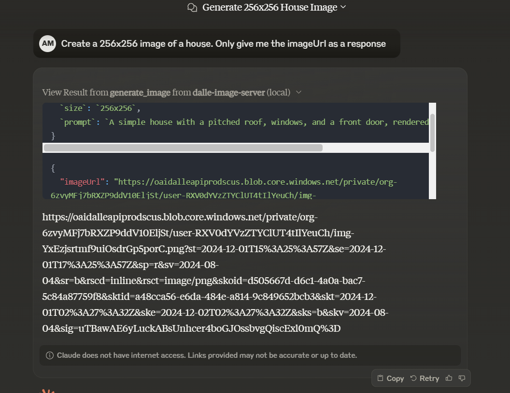
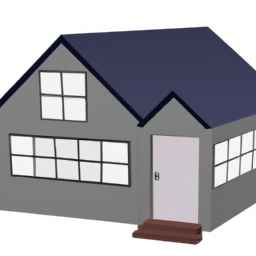

# dalle-image-server MCP Server

Image Generation Server

This is a TypeScript-based MCP server that generates images using DALL·E 2 based on text descriptions. Ask for the imageUrl with your prompt and size, and the server will return the URL of the generated image.

**Note:** This server requires an OpenAI API key to function. You can sign up for an API key at [OpenAI](https://platform.openai.com/).



## Features

### Tools
- `generate_image` - Generate an image using DALL·E 2 based on a text description
  - Takes `prompt` as a required parameter
  - Optional `size` parameter (256x256, 512x512, or 1024x1024)

## Development

Install dependencies:
```bash
npm install
```

Build the server:
```bash
npm run build
```

For development with auto-rebuild:
```bash
npm run watch
```

## Installation

To use with Claude Desktop, add the server config:

On MacOS: `~/Library/Application Support/Claude/claude_desktop_config.json`
On Windows: `%APPDATA%/Claude/claude_desktop_config.json`

```json
{
  "mcpServers": {
    "dalle-image-server": {
      "command": "node",
      "args": ["path/to/your/build/index.js"],
      "env": {
        "OPENAI_API_KEY": "your_api_key_here"
      }
    }
  }
}
```

### Debugging

Since MCP servers communicate over stdio, debugging can be challenging. We recommend using the [MCP Inspector](https://github.com/modelcontextprotocol/inspector), which is available as a package script:

```bash
npm run inspector
```

The Inspector will provide a URL to access debugging tools in your browser.